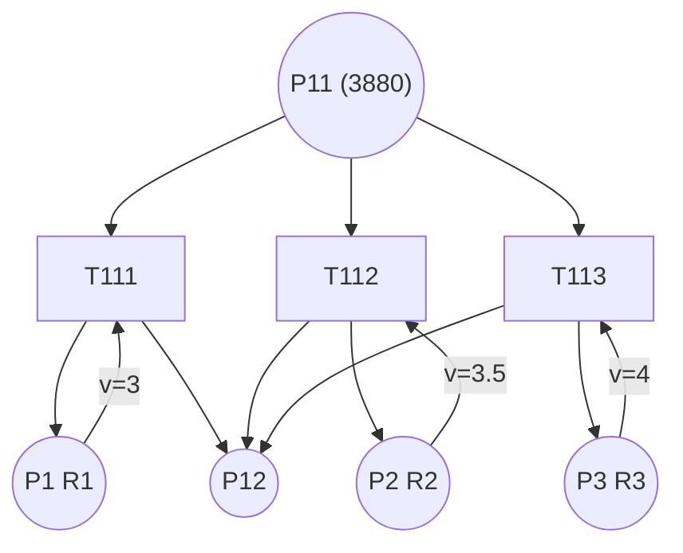

Computers and Electronics in Agriculture 66 (2009) 181–190

Contents lists available at ScienceDirect

Computers and Electronics in Agriculture

journal homepage: www.elsevier.com/locate/compag

# Resource assignment and scheduling based on a two-phase metaheuristic for cropping system

Senlin Guan a,∗, Morikazu Nakamura a, Takeshi Shikanai b, Takeo Okazaki a

a Faculty of Engineering, University of the Ryukyus, 1 Senbaru Nishihara, Okinawa 903-0213, Japan
b Faculty of Agriculture, University of the Ryukyus, 1 Senbaru Nishihara, Okinawa 903-0213, Japan

**ARTICLE INFO**

*Article history:*
Received 5 August 2008
Received in revised form 25 January 2009
Accepted 29 January 2009

*Keywords:*
Farm work planning
Scheduling
Metaheuristic
Simulated annealing
Genetic algorithm
Hybrid Petri nets
Modeling
Sugarcane

**ABSTRACT**

This paper proposes a resource assignment and scheduling based on a two-phase metaheuristic for a long-term cropping schedule. The two-phase metaheuristic performs the optimization of resources assignment and scheduling based on a simulated annealing (SA), a genetic algorithm (GA) and a hybrid Petri nets model. The initial and progressive states of farmlands and resources, moving sequence of machinery, cooperative work, and deadlock removal have been well handled in the proposed approach. In the computational experiment, the schemes of emphasizing the resource assignment optimization, initializing the population of the GA with chromosomes sorted by the waiting time, and inheriting the priority list from tasks in the previous resources assignment improved the evolution speed and solution quality. The simulated result indicated that the formulated schedule has a high ratio of resource utilization in sugarcane production. The proposed approach also contributes a referential scheme for applying the metaheuristic approach to other crop production scheduling.

© 2009 Elsevier B.V. All rights reserved.

## 1. Introduction

In Okinawa, south Japan, approximately 50% of the farmland is used for growing sugarcane, a major crop, and nearly 70% of the farmers are involved in its production (The Ministry of Agriculture, Japan, 2006). In recent years, some issues such as an increasing number of aging farmers and low income have resulted in the abandonment of arable land. In order to avoid cultivation abandonment, various countermeasures have been adopted by the leaders of regional farmers; these leaders lease and consolidate abandoned farmland and organize agricultural corporations that manage large-scale farmland with full mechanization. Additionally, Japanese government is considering the agricultural land integration plan by setting out to promote land-leasing and secure contract for farm work with local owners for efficient use of agricultural land. The policy accelerated the integration of agricultural land into the hands of certified farmers who aim for efficient and stable farm management and agricultural corporations established by an agreement of local farmers.

However, the leased farmlands managed by these corporations are geographically scattered, and the corporation workers have to

move from field to field to carry out farm work. The scattered farmland brings on inefficient work, and competes for the limited farm resources such as machinery and labor during the cropping season. Moreover, these corporations not only manage their leased farmlands, but also carry out extra farm works entrusted by individual farmers in order to increase the revenue of the corporation. Usually, all these works are poorly managed for lack of time and suitable schedule. Thus, the farm work usually begins late in the season and the optimal timing is missed. Despite managing large-scale farmland, the sugarcane yield per unit area of these agricultural corporations is lower than that of conventional farmers.

As compared with the corporations that operate a special farm work by their machineries, for example, the sugarcane mill or harvesting operatives, the mentioned corporations in this paper have to extend the contracts of leasing farmland, lease more farmlands, and carry out extra works in order to increase production and economic growth and enlarge the scale of management for further development. They firstly require an annual and overall plan for carrying out their own farm works as well as the extra farm works in an organized and planned manner for stable and efficient management, and secondly, they require a detailed schedule for short-term works in the presence of changes of weather or uncertainty. Their requirements have been attracted our research interest. At present, we have developed an integrated cropping management system for sugarcane production. The system comprises a farm data recording system (Guan et al., 2006), a Web-based management system, and a

∗ Corresponding author. Tel.: +81 90 6638 1688; fax: +81 98 895 8727.
*E-mail addresses:* guansid@gmail.com (S. Guan), morikazu@ie.u-ryukyu.ac.jp (M. Nakamura).

0168-1699/$ – see front matter © 2009 Elsevier B.V. All rights reserved.
doi:10.1016/j.compag.2009.01.011

modeling (Guan et al., 2008) and scheduling system. The farm data recording system indicates the daily work schedule for workers, and records of the progress of daily farm work, rain delay, machinery breakdowns, changes in works due to crop growing condition, and so on. The Web-based management system provides a platform for the maintenance of a database and the generation of analysis reports. The modeling system models the farm work flow and uncertainty into mathematical data and acts as a simulation tool for describing the overall status of the progress of farm work and the availability of resources. Scheduling system provides the farmers with a long-term schedule and a real-time schedule, and plays the most important role in the entire system.

It is well known that a scheduling problem under uncertainty is difficult to optimize (Garey and Johnson, 1979). A schedule, in which uncertainty due to progressive and environmental changes has already been considered, has greater serviceability and reliability than one that is based on deterministic data. Considerable research has been carried out on scheduling problems under uncertainty (Bassett et al., 1997; Janak and Floudas, 2006; Lin et al., 2004; Till et al., 2007; Wang, 2004), and an instructive survey on evolutionary optimization in uncertain environments has been offered in Jin and Branke (2005). In the field of agriculture, some effective methods for farm work planning have been developed thus far (Arjona et al., 2001; Daikoku, 2005; Haffar and Khoury, 1992; Nanseki, 1998; Tsai et al., 1987). Astika et al. (1999) have also proposed a stochastic farm work scheduling algorithm based on short-range weather variation. These researches usually target a specific farm work problem, and they are generally unsuitable for generating the daily schedule of an entire growth cycle and for assigning necessary resources to field operations in geographically dispersed farms.

In this study, we emphasized a two-phase metaheuristic for a long-term and reactive scheduling under constraints. The research focuses on the cropping system and particularly sugarcane production for those cropping agricultural corporations. The heuristic approach is advantageous for dealing with various uncertainties such as stochastic changes or arbitrary changes that are not in terms of a probability distribution (Lin et al., 2004; Santiago-Mozos et al., 2005; Suliman, 2000). In the first phase, resource assignment is optimized using a simulated annealing (SA) algorithm (Laarhoven et al., 1992), and in the second phase, the optimization is based on a genetic algorithm (GA) (Man et al., 1999), which searches for the optimal schedule according to the firing rules of hybrid Petri nets (David and Alla, 2001). The approaches on formulation and simulations were examined in the simulation computation. In the experiment, the schemes of improving the evolution speed and solution quality were clarified.

The remainder of this paper is organized as follows. First, the constraints in practical cropping systems are described and formulated into a mathematical definition in detail. Then, the two-phase heuristic approach for resource assignment and scheduling that also considers constraints is presented. Next, a simulation experiment and computational results are described in order to validate the proposed approach. Finally, we conclude the paper and present our final remarks.

## 2. Problem definition and formulation

### 2.1. Long-term and reactive scheduling

In the integrated management, the scheduling system contains two parts: a long-term and reactive scheduling, and an online scheduling. The long-term and reactive scheduling computes and updates a long-term schedule for the entire growth cycle after the completion of farm work on a daily basis, and is valuable for making an overall and sketchy cropping plan in every crop growth cycle. The

long-term and reactive scheduling system has over 10 h for computation and the ability of self-updating and inheriting the current best schedule. The computed result will approach the practical plan gradually with increasing accuracy. In the long-term and reactive scheduling, making annual plan does not require enough accuracy. Referring to the long-term scheduling result and rough estimation data of operation risks, we can obtain a sketchy solution for various objectives by changing the parameters of the algorithm. Such solutions include: (1) the number of farmlands they can lease, (2) the geographical location and the condition of the farmland they are planning to lease, (3) the amount of extra work they can carry out, (4) previous interests if they have more machinery or labor, and so on.

As compared with the long-term and reactive scheduling, the online scheduling provides workers with the newest schedule in a short time when the status of resources or the environment changes, and is valuable for making a real-time schedule when breaks and uncertainties are considered. The online scheduling result is more detailed and applicable than that of the long-term and reactive scheduling. It runs when changes are recorded by a mobile terminal with an Internet connection, and transfers the computation result to the operators within a few seconds. Subject to a few seconds for computation, the online scheduling is restricted for a short-term using limited resources such as the farmlands having incomplete work, the available resources for a specified work, the works within a week, and so on. In addition, the algorithm used for online scheduling system will inherit the current best schedule from the long-term scheduling result in order to improve the computation efficiency.

The problem definition and formulation in this research is targeted to the long-term and reactive scheduling.

### 2.2. Constraints in practical cropping systems

For each farmland in an agricultural corporation, there is a series of tasks ranging from planting work to harvesting in a crop growth cycle. Considerable machinery and labor are available for any corresponding work. As an example, we used sugarcane farming to demonstrate the ability of the proposed model and algorithm to construct a long-term and reactive cropping schedule. In Okinawa, sugarcane is grown in three crop classes: spring plant crop, harvested in the first winter by planting in spring; summer plant crop, harvested in the second winter by planting in summer; and ratoon crop, harvested in the first winter by growing the bud after the cane field has been harvested. Most farm works involved in these crop classes are similar in a single farmland. The major farm works for spring plant crop involve plowing, seeding, planting, fertilizing, irrigation and harvesting. Each farm work requires the allocation of resources such as machinery and labor.

In order to theoretically describe the conditions in a long-term cropping schedule, we use $N_F$, $N_W$, $N_R$ to indicate the total number of farmlands, works in a crop growth cycle, and resources, respectively. Other notations and their descriptions are listed in Table 1. Note that $I_{ij}$ represents whether work $W_j$ will be performed or not and $m_{ij}$, the amount of scheduled work $W_j$ in $F_i$ (where $I_{ij} > 0$). $W_j$ will be scheduled if $m_{ij} > 0$; otherwise, this work will be not performed in $F_i$. The execution of the extra work is determined by $I_{ij}$ and $m_{ij}$. The parameters of the waiting time $W_{ij}$, predefined work period $[P_j(s), P_j(e)]$ are used to define an appropriate cultivation time. Usually, $P_j(s)$ is larger than $P_{j-1}(e)$, and thus, the farm works $W_{j-1}$ and $W_j$ can be performed simultaneously. For example, the work of plowing and harvesting may take place on the same workday by different resources.

During resource assignment, it must be ensured that at least one resource is assigned to perform $W_k$, and the total number of assigned resources is less than $\sum_k S_{jk}$, that is, the total number

Table 1
Definition of variables.
| Notation | Definition |
|---|---|
| $F_i$ | Farmland $i$, $i \in \{1, \dots, N_F\}$ |
| $W_j$ | Work $j$, $j \in \{1, \dots, N_W\}$ |
| $R_k$ | Resource $k$, $k \in \{1, \dots, N_R\}$ |
| $A_i$ | Area of $F_i$ |
| $I_{ij}$ | $I_{ij} \in \{0, 1\}$, 1: $W_j$ should be performed in $F_i$; otherwise, 0 |
| $m_{ij}$ | Amount of scheduled work $W_j$ in $F_i$, $m_{ij} \in [0, A_i]$ |
| $S_{jk}$ | $S_{jk} \in \{0, 1\}$, 1: $R_k$ is available to perform $W_j$; otherwise, 0 |
| $S'_{jk}$ | $S'_{jk} \in \{0, 1\}$, 1: $R_k$ is scheduled to perform $W_j$; otherwise, 0 |
| $v_k$ | Working speed of $R_k$ |
| $W_{ij}$ | Waiting time between end time of $W_{j-1}$ and start time of $W_j$ in $F_i$ |
| $P_j(s), P_j(e)$ | Predefined work period [start time $P_j(s)$, end time $P_j(e)$] for $W_j$ |
| $T_{ijk}$ | Task performed in $F_j$ by $R_k$, for $W_j$ |
| $t^{R_k}_{ij}(s), t^{R_k}_{ij}(e)$ | Start (end) working time of work $j$ in $F_i$ by $R_k$ |
| $v'_k$ | Moving speed of $R_k$ |
| $D_{ab}$ | Distance between $F_a$ and $F_b$, $a, b \in \{1, \dots, N_F\}$ |

of resources available to perform $W_k$. A resource is not defined as an individual resource but as a set of the minimum machinery and labor required for the work. If more than two resources are assigned to the same work $k$ ($\sum_k S'_{jk} > 1$), it is possible to perform cooperative work. Cooperative farming work is defined as a process where multiple machineries perform the same work, and the entry time of a resource to perform cooperative farming work is arbitrary.

$$
1 \le \sum_{k} S'_{jk} \le \sum_{k} S_{jk} \tag{1}
$$

The amount of scheduled work $m_{ij}$ is completed by certain resources $R_k$ during $t^{R_k}_{ij}(s)$ and $t^{R_k}_{ij}(e)$ at working speed $v_k$. For any resource allocation scheme, the following equations exist:

$$
m_{1j} = [t^{R_1}_{1j}(e) - t^{R_1}_{1j}(s)]v_1 + [t^{R_2}_{1j}(e) - t^{R_2}_{1j}(s)]v_2 + \dots + [t^{R_k}_{1j}(e) - t^{R_k}_{1j}(s)]v_k
$$
$$
m_{2j} = [t^{R_1}_{2j}(e) - t^{R_1}_{2j}(s)]v_1 + [t^{R_2}_{2j}(e) - t^{R_2}_{2j}(s)]v_2 + \dots + [t^{R_k}_{2j}(e) - t^{R_k}_{2j}(s)]v_k
$$
$$
\vdots
$$
$$
m_{ij} = [t^{R_1}_{ij}(e) - t^{R_1}_{ij}(s)]v_1 + [t^{R_2}_{ij}(e) - t^{R_2}_{ij}(s)]v_2 + \dots + [t^{R_k}_{ij}(e) - t^{R_k}_{ij}(s)]v_k
$$

The above equations can be organized as:

$$
\begin{bmatrix}
t^{R_1}_{1j}(e) - t^{R_1}_{1j}(s) & t^{R_2}_{1j}(e) - t^{R_2}_{1j}(s) & \cdots & t^{R_k}_{1j}(e) - t^{R_k}_{1j}(s) \\
t^{R_1}_{2j}(e) - t^{R_1}_{2j}(s) & t^{R_2}_{2j}(e) - t^{R_2}_{2j}(s) & \cdots & t^{R_k}_{2j}(e) - t^{R_k}_{1j}(s) \\
\vdots & \vdots & \ddots & \vdots \\
t^{R_1}_{ij}(e) - t^{R_1}_{ij}(s) & t^{R_2}_{ij}(e) - t^{R_2}_{ij}(s) & \cdots & t^{R_k}_{ij}(e) - t^{R_k}_{ij}(s)
\end{bmatrix}
\begin{bmatrix}
v_1 \\
v_2 \\
\vdots \\
v_k
\end{bmatrix}
=
\begin{bmatrix}
m_{1j} \\
m_{2j} \\
\vdots \\
m_{ij}
\end{bmatrix}
\tag{2}
$$

In order to avoid the superposition of durations $[t^{R_k}_{ij}(s), t^{R_k}_{ij}(e)]$ and $[t^{R_k}_{pq}(s), t^{R_k}_{pq}(e)]$ ($p \in \{1, \dots, N_F\}, q \in \{1, \dots, N_W\}$), we have the fol-

lowing conditions:

$$
\begin{aligned}
\forall i, j, p, q, k, \quad & t^{R_k}_{ij}(s) < t^{R_k}_{ij}(e) \\
& t^{R_k}_{ij}(e) < t^{R_k}_{pq}(s) \dots \text{if } t^{R_k}_{ij}(s) < t^{R_k}_{pq}(s)
\end{aligned}
\tag{3}
$$

For the work to be punctual, the start working time $t^{R_k}_{ij}(s)$ and the end working time $t^{R_k}_{ij}(e)$ need to take into account the additional conditions stated in Eq. (4), where $k' \in \{1, \dots, N_R\}$.

$$
\begin{aligned}
\forall i, j, k, k', \quad & t^{R_k}_{ij}(s) \ge \max(P_j(s), t^{R_{k'}}_{i(j-1)}(e) + W_{ij}) \\
& t^{R_k}_{ij}(e) \le \max(P_j(e), t^{R_{k'}}_{i(j-1)}(e) + W_{ij})
\end{aligned}
\tag{4}
$$

The works for farmland $i$ are subject to the precedence constrained relation (Chekuri and Motwani, 1999); in other words, a latter work $W_j$ can only start after the completion of a former one $W_{j-1}$. This condition is defined by

$$
\forall i, j, k, k', \quad t^{R_k}_{ij}(s) > t^{R_{k'}}_{i(j-1)}(e) \tag{5}
$$

Considering the moving time between farmlands, the start time of the next work should be the sum of the completion time of the previous work and the moving time

$$
\forall a, b, j, k, \quad t^{R_k}_{aj}(s) \ge t^{R_k}_{bj}(e) + D_{ab}/v'_k \tag{6}
$$

On the basis of the above conditions, the objective of scheduling is formulated as the following equation:

$$
\min \Biggl( \sum_{a,b,j,k} [t^{R_k}_{bj}(s) - t^{R_k}_{aj}(e)] \Biggr) \tag{7}
$$

where task $t^{R_k}_{bj}$ is a latter task of $t^{R_k}_{aj}$ ($t^{R_k}_{bj}(s) \ge t^{R_k}_{aj}(e)$). Minimizing the idle time between works leads to a high ratio of the utilization of machinery, and accommodates the purpose of the overall long-term schedule in this research. The objective is the same as minimizing the make-span in a common scheduling problem. In practice, the scheduling objective can take many forms such as minimizing the make-span, maximizing plant throughput, maximizing profit or minimizing production costs. These objectives or some multiobjectives can be formulated according to the problem, along with the updating of the constraints, and the corresponding evaluation functions.

### 2.3. Formulating cropping schedule on hybrid Petri nets

A Petri net is a graphical and mathematical modeling tool used for describing and simulating the concurrent, asynchronous, distributed, parallel, nondeterministic, and/or stochastic activities of systems (Murata, 1989). It is widely used to model discrete and continuous systems such as computer systems and flexible manufacturing systems and so on. A Petri net is graphically represented by a directed bipartite graph, and it contains structural components of places, transitions, and arcs. In a Petri net, places drawn as circles are used to describe local system states, and transitions drawn either as bars or boxes are used to describe events that may modify the system state. Arcs that connect places and transitions represent the relationships between local states and events. A distribution of tokens, that are the black dots in places of a discrete Petri net or the real number in places of a continuous Petri net, is called a marking.

A basic Petri net is called a discrete Petri net $\mathcal{N}$ in which the marking in places is marked by discrete numbers. In comparison with a discrete Petri net, a continuous Petri net represents continuous work process with the marking marked by real numbers. Hybrid Petri nets informally contain a discrete part and a continuous part of Petri net. In many cases, a work process may be approximately modeled for continuous flow, but the state of resources is necessarily discrete. Hence, the hybrid Petri nets model is considered for

> ⚠️ [fallback] diagrama não convertido; abaixo, imagem original e descrição.


Trata-se de um diagrama esquemático que representa um modelo de Rede de Petri híbrida dividido em três níveis horizontais correspondentes a diferentes fazendas ($F_1$, $F_2$ e $F_i$). O fluxo principal em azul conecta lugares contínuos de círculos duplos e transições retangulares que representam o status do trabalho agrícola, enquanto redes pretas ao redor modelam o controle de recursos discretos, com conexões pontilhadas coloridas indicando transferências entre os níveis. Na parte inferior, uma tabela de legenda em inglês especifica o significado de cada símbolo, diferenciando lugares, fichas, transições e arcos contínuos de seus equivalentes discretos.

Fig. 1. Hybrid Petri nets model for scheduled farm work.

modeling such systems (David and Alla, 2001). A hybrid Petri nets system is defined as $\mathcal{N} = \langle P, T, Pre, Post, M_0, h \rangle$, where $P$ is a set of places; $T$, a set of transitions; $Pre$ ($Post$), the pre- (post-) incidence function representing the input (output) arcs; $M_0$, a function representing the initial number of tokens; and $h$, a hybrid function that indicates a discrete or continuous node.

Fig. 1 illustrates the hybrid Petri nets model for scheduled farm work. The name and description for each structural element are shown in the below of the figure. The discrete part of the Petri net comprises the discrete places that are drawn as single-line circles and the discrete transitions that are drawn as bars. The state of resource $R_k$ is represented by token distribution, where a token is represented by a black dot within a place. The continuous part contains continuous places $P_{ij}$ that are drawn as double-line circles, and continuous transitions that are drawn as boxes. The real number in $P_{ij}$ shows the amount of token, interpreted as the amount of farm work. At the start time of $W_j$ in $F_i$, the value in $P_{ij}$ is set to $m_{ij}$, while the value in other places corresponding to $F_i$ is set to zero. For example, the amount of farm work (token) in places $P_{11}, P_{12}, \dots P_{1j}$ is as 3880, 0, ... 0 in the initial state. A continuous transition, whose naming is the same as that of task $T_{ijk}$, denotes performing the task in farmland $F_i$ by $R_k$, for work $j$. Each continuous transition and place is associated with a predefined work duration $[P_j(s), P_j(e)]$ and a waiting time $W_{ij}$, respectively.

In a Petri net, transitions act on input tokens by a process known as firing. When a transition fires, it consumes the tokens from its input places, performs some processing task, and places a specified number of tokens into each of its output places. Transitions are enabled for execution when tokens in its input places satisfy the firing condition. In the model for the cropping system, this implies that a work can be carried out when the conditions and resources such as machineries and labors required for the work are satisfied. The conditions for cultivation here may be in many forms such as the wetness of farmland, the status of crop growth, the maturity of crop, time window, the status of resource, and so on. The working time for a task corresponds to the firing time of a continuous transition, depending on the working speed of resources. When a farming work is completed, the corresponding farmland switches to a new state while the labor and machinery are released and ready for other works.

This hybrid Petri nets model acts as not only modeling the cropping process, but also simulating farm work. Along with the execution of farm work, the tokens in a corresponding place vary with time. Therefore, monitoring the marking of the hybrid Petri nets, that is a vector representing the present amount of tokens, implies that we monitor the farming progress and the status of farmlands and resources. By using hybrid Petri nets, the major constraints arising in a scheduling problem can be formulated graphically, and there is no necessity to define any variable or constraint mathematically. As a result, a substantial reduction in the complexity of problem formulation is achieved (Sadrieh et al., 2007). A detailed description of the hybrid Petri nets modeling for farm work flow can be found in Guan et al. (2008).

### 2.4. Formulating the cooperative work, break, and uncertainty on hybrid Petri nets

The cooperative farming work and breaks are modeled in Fig. 2, that is a part of Fig. 1. For example, at the initial state (Fig. 2(a)), work $W_1$ in farmland $F_1$ will be started by resources $R_1$, $R_2$ and $R_3$ cooperatively. The working speed of resources $R_1$, $R_2$ and $R_3$ is set to 3 m²/min, 3.5 m²/min, and 4 m²/min, respectively. In case of that the break time is ignored, the work time for $W_1$ in $F_1$ is 6.16 h if

$R_1$, $R_2$, and $R_3$ are used simultaneously. However, if no tokens are assigned to $P_2$ and $P_3$, the work time will be 21.56 h.

The break time includes the normal break time and the time that may be consumed by uncertainties such as machinery breakdown, weather, and so on. For each resource $R_i$, the break and resumption for task $T_{ijk}$ are primarily modeled a discrete part of Petri net connected to a continuous transition $T_{ijk}$, which comprises two discrete transitions and two discrete places. In addition, an uncertainty like weather is represented by a discrete place connecting to $T_{ijk}$. This discrete place is connected to transitions controlled by external environment (external PN). Such discrete places are generated according to the number of uncertainties. Likewise, arbitrary resources, constraints or conditions can be formulated on hybrid Petri nets.

For example, in Fig. 2(b), if the weather accommodate the execution of task $T_{111}$, a token in place $P_3$ will exist; otherwise, $T_{111}$ can not be started since no token in $P_3$. Assuming that a token is in $P_3$, the system at the beginning is in the break state since the token is in $P_2$. The token will be transmitted to $P_1$ after 30 min by firing the discrete transition $T_2$, and then the farming work starts. At a time of 120 min, the system shifts into the break state by firing transition $T_1$ because a discrete transition has priority over a continuous transition. If we define the break time list for $T_1$ and $T_2$ beforehand, all breaks in the work can be described and modeled.

### 2.5. Simulating the constraints by hybrid Petri nets

All the constraints defined in Eqs. (1)–(6) can be completely represented on hybrid Petri nets. The firing rules of hybrid Petri nets are summarized as:

(1) Arbitrary cooperation is possible if work $W_j$ in farmland $F_i$ is incomplete. This rule corresponds to Eq. (1). It limits the number of assigned resources from one to the number of total available resources for $W_j$ in $F_i$. Since the hybrid Petri nets model is dynamically generated, the number of discrete places connecting to a continuous transition is equal to the number of assigned resources. Once the resources are assigned, the hybrid Petri nets model including the continuous places, continuous transitions, and discrete places can be generated. However, the arcs from the continuous transition to the discrete place cannot be created until the working sequence is determined.

(2) If a resource $R_k$ is scheduled to carry out work $W_j$, although $W_j$ has already been completed by cooperative work, then $R_k$ is scheduled to the next task. This rule prevents the occurrence of a deadlock condition during the firing operation in the system. A deadlock may be caused by cooperative resource assignment according to Eq. (1).

(3) The scheduled work must be completed; further, the firing operation stops when all tasks are completed. Its mathematical definition is described in Eq. (2). The firing operation suffers from the characteristic of hybrid Petri nets.

(4) The work must be completed in the predefined work period, and the next work $W_j$ must wait for the duration of the waiting time after completing work $W_{j-1}$. These two constraints are defined in Eq. (4).

(5) According to the precedence constrained relationship, a latter work $W_j$ can only start after the completion of a former one $W_{j-1}$. This rule corresponds to Eq. (5). For example, if the token in $P_{12}$ is less than 3880, tasks $T_{124}$ and $T_{125}$ cannot be started even if the remaining conditions such as waiting time and moving time are satisfied.

(6) The moving time between farmlands, which is defined by Eq. (6), should be considered in the hybrid Petri nets. In the exper-



Fig. 2. Hybrid Petri nets model for cooperative work, and breaks or uncertainties. (a) Cooperative farm work, (b) modeling the breaks ($t = 0$).

iment, the moving time is associated to the discrete transition.

(7) Breaks may occur at arbitrary time.

Rule (7) corresponds to the online scheduling. The constraints defined in Eq. (3) have no corresponding rule since working durations cannot overlap according to the natural firing characteristic of hybrid Petri nets.

The model adequately accommodates those cropping process requiring corresponding resources like machinery and labor. In order to obtain the overall and long-term schedule, we applied a single model for the formulation in each growth stage. However, the model can also model and formulate problems for a single growth stage of crop, including planting and harvesting scheduling problem. The corresponding setting is set $I_{ij}$ to zero for screening the works in other stages. In the model, all the constraints are defined as the discrete places or tokens of Petri nets. Appending a constraint in a specified growth stage is easily realized by supplementing the discrete places or tokens into the Petri nets model. The accompanying notes are that (1) the equations may be supplemented or modified for adapting a different condition; (2) the firing rules of Petri nets should be updated; and (3) for other scheduling objectives, the evaluation function should be redefined.

## 3. Two-phase metaheuristic algorithm

A cropping schedule includes assigning resources and arranging a work sequence. In the first phase, a scheme of assigning resources is determined and optimized. In the second phase, the work sequence is designated as a priority list in which works are arranged according to a specific priority. The priority list is optimized for minimizing the idle time between tasks according to the firing rules of hybrid Petri nets.

### 3.1. SA for optimizing resource assignment

Assigning resources in the first phase enables deadlock prevention in the system, a situation where two or more competing works await the release of resources and neither obtains the necessary resources. A conventional SA is used for an optimization subjected to the condition given in Eq. (1). The independent variable $x$ in the SA procedure is set to a resource assignment. $x'$, that is, another independent variable in the neighboring region of $x$, represents an alterable resource assignment for cooperative work. The pseudo

code for SA is described as:

```text
00: begin
01:   initialize temperature T, neighboring space N;
02:   initialize resource assignment x, and minimum fitness min;
03:   evaluate fitness F_x (= gaPls(x)) in 2nd phase;
04:   while (not termination-condition) do
05:     for i = 1 to N
06:       generate another resource assignment x';
07:       evaluate fitness F'_x (= gaPls(x')) in 2nd phase;
08:       if (F'_x < F_x) then
09:         replace x with x';
10:       else
11:         if (random(0,1) < exp( (F_x - F'_x)/T) then
12:           replace x with x';
13:         end if
14:       end if
15:       if (F_x < min) then
16:         update min with F_x, and memorize x';
17:       end if
18:     end for
19:     replace T with (T - T * alpha); 0 < alpha < 1
20:   end while
21: end
```

Note that the notations in the pseudo code differ from those in Table 1. Once a resource assignment is determined, the length of chromosomes in the GA in the next phase can be designated, and places and transitions except arcs of the hybrid Petri nets model can be constructed.

### 3.2. GA for priority list scheduling

By using resource assignment, the second metaheuristic GA searches for priority lists and generates the schedule according to the hybrid Petri nets model. We have applied the one-point order crossover, one-bit reverse mutation and roulette selection similar to those in traditional GAs. An elite reservation has also been incorporated.

The priority list is encoded into a chromosome of the GA, in which the tasks (genes) are grouped by work $W_j$. The crossover and mutation operations are restricted to those between the tasks in the same work $W_j$. The fitness function evaluates the sum of the moving time and the idle time between the tasks. This objective is achieved by simulating the activities of the hybrid Petri nets model. The pseudo code of the GA is briefly described in procedure gaPls(x), followed by the procedure for evaluating the fitness. The evaluation procedure is executed according to the firing rules of Petri nets. The schedule will be generated when the firing

operation stops and it will be recorded along with the priority list if it has the current best fitness.

```text
00: procedure gaPls(x)
01: begin
02:   initialize population c with chromosomes sorted by waiting time W_ij;
03:   reinitialize population c inheriting best priority list from x;
04:   construct continuous part of hybrid Petri nets;
05:   evaluation(c);
06:   while not-termination-condition do
07:     selection;
08:     crossover;
09:     mutation;
10:     evaluation(c);
11:   end while
12: end

00: procedure evaluation(c)
01: begin
02:   for r = 1 to popSize
03:     construct the discrete part of the hybrid Petri nets;
04:     initial time interval tau; current time t = 0;
05:     while tasks-are-not-completed do
06:       if (firing-conditions-are-satisfied) then
07:         firing and update the amount of tokens in corresponding places;
08:       end if
09:       update t with t + tau;
10:       update the sum of moving time and idle time;
11:     end while
12:     if (best-fitness-found) then
13:       update current best fitness, priority list, and schedule;
14:     end if
15:   end for
16: end
```

### 3.3. Deadlock removal

In a conventional optimization, the conflicts of resource use have to be examined for deadlock removal. For example, when we attempt to assign a resource to a work in a conventional optimization, we have to check whether or not it is already being used for another work simultaneously; if no available resource is ready for the work, the computing will shift into a waiting state until some resource is released. Since in the GA iteration, the computation time is the product of the size of the population, generation, and evaluation, a long evaluation time that is wasted in resolving the deadlock of resource use results in an inefficient search. Furthermore, in the GA evaluation process, some individuals may be infeasible solutions if the work is scheduled across the time window for cultivation. In contrast, assigning resources first in the two-phase optimization may prevent deadlocks caused by resource conflict. Each resource


Um gráfico de linhas compara o valor de *Fitness* (no eixo vertical, de 150 a 450) em relação ao tempo de execução em segundos (no eixo horizontal, de 0 a 35.000 s) para duas configurações: "gen-100" (linha contínua) e "gen-1000" (linha pontilhada). Ambas as curvas apresentam uma queda acentuada logo no início do processo, antes dos 5.000 segundos, estabilizando-se em patamares horizontais pelo restante do período. A configuração "gen-100" atinge um valor final de *Fitness* menor, estabilizando-se ligeiramente abaixo de 175, enquanto a "gen-1000" estabiliza-se em torno de 180.

Fig. 3. Evolution based on optimizing resource assignment and priority list.

will be scheduled for the work according to the task sequence, and resources will be independent each other. Moreover, the inheriting operation in the second phase avoids resuming a search from an unknown origin; therefore, the searching efficiency is improved.

## 4. Experimental results

The experiment data was obtained from a sugarcane-producing corporation that manages 76 farmlands using considerable machinery. The major farm works for cultivating sugarcane in the spring growth cycle, defined as $W_j$, involve plowing, planting, irrigating, weeding, fertilizing, and harvesting work within a predefined work period. The number of available resources required for these works $W_1, W_2, \dots W_6$ is assumed to be 2, 1, 1, 1, 1, and 3, respectively. By referring to the available resources, cooperative work can be carried out for the work of plowing and harvesting. All the constraints are considered in the proposed algorithm. However, some works may not satisfy Eq. (4) because the time required for a practical farm work may exceed the predefined work period. In this case, we will reserve the corresponding schedule and increase its fitness slightly.

Our algorithm is implemented in the C language in order to integrate other subsystems. A Mac Pro with Quad-Core Intel Xeon and 4GB RAM running Mac OS X 10.5 was used as the computing platform. The computation time depends on the parameters of the SA, GA, and time increment in the hybrid Petri nets, and it is approximately 10 h when $N = 200, \alpha = 0.02$ in the SA; population size = 20 and the number of generations = 200 in the GA; and time increment = 10 min in the hybrid Petri nets. Since the program runs from the completion time of the last work in a workday to the start time of the first work in the next day, less than 12 h are allowable.

### 4.1. Optimizing resource assignment and priority list

Fig. 3 shows the contrasting effect on optimizing resource assignment and priority list corresponding to the different generation sizes in the GA. The curves are drawn by using the current best fitness against execution time. “gen-100” represents the evolution process for the high frequency of optimizing resource assignment but a short computation time for optimizing the priority list. As


Um gráfico de linhas em degraus compara o valor de *fitness* (eixo vertical, de 150 a 450) ao longo do tempo de execução em segundos (eixo horizontal, de 0 a 5000) para três abordagens: *Unsorted*, *Once sorted* e *Entirely sorted*. A curva *Unsorted* inicia com o maior valor de *fitness* (acima de 400) e apresenta a redução mais lenta, estabilizando em torno de 210, enquanto *Once sorted* parte de aproximadamente 290 e finaliza perto de 180. A configuração *Entirely sorted* tem a convergência mais rápida, caindo bruscamente nos primeiros 300 segundos e alcançando o menor valor final de *fitness*, em torno de 175.

Fig. 4. Effect of initializing population by sorted chromosomes.

compared with “gen-100”, “gen-1000” emphasizes optimizing the priority list but results in a reduction in the frequency for optimizing resource assignment at the same computation time.

As shown in the figure, not only a fast evolution but also a good solution quality appears in “gen-100”, especially at an early evolution stage. This reveals that increasing the frequency of optimizing resource assignment is conductive for fast evolution and convergence in computation. It is considered that resource assignment is an important factor in generating an efficient schedule. Note that increasing the frequency of optimizing the resource assignment does not weaken the optimization in the second phase. A strategy of inheriting the present best priority list is adopted for reserving and further improving the quality of the solution in the second phase, which is discussed below.

### 4.2. Strategies of initializing population of GA

Generally, the waiting time between works ($W_{ij}$) has a significant influence on the solution quality. The best schedule can be derived from sorted tasks according to the order of $W_{ij}$ if all $W_{ij}$ are different and other constraints are ignored. In practice, however, the waiting time between works is almost the same because of the uniformity of farm works in all farmlands. When the waiting time is almost the same between works, the effect of sorting works by $W_{ij}$ on the solution quality is shown in Fig. 4.

The curves show the evolution process that started from three initialized populations with raw chromosomes (unsorted), one sorted chromosome, and entirely sorted chromosomes. It is obvious that the evolution speed of the curve titled “Unsorted” is the slowest as compared with those of the other two curves. A high evolution speed and high solution quality are obtained when the initializing population comprises the entirely sorted chromosomes.


Trata-se de um gráfico de linhas em preto e branco que relaciona o tempo de execução em segundos no eixo horizontal (de 0 a 35.000 s) ao valor de *Fitness* no eixo vertical (de 150 a 450). Cinco curvas com diferentes estilos de linha representam configurações de "cpr" variando de 0% a 100%, todas apresentando uma queda acentuada nos primeiros 5.000 segundos até se estabilizarem em patamares horizontais. A configuração de 100% atinge o menor valor final de *Fitness* (pouco abaixo de 175), enquanto a de 0% estabiliza-se no patamar mais elevado (em torno de 230).

Fig. 5. Effect of inheriting the present best priority list.

For the curve representing one sorted chromosome, the fitness will suffer from other constraints such as moving time; therefore, both the evolution speed and solution quality are weaker than those of the curve titled “entirely sorted”. Because the chromosomes are sorted by almost the same waiting time, they may exhibit further variations. Therefore, the population comprising entirely sorted chromosomes by $W_{ij}$ may have a higher probability of approaching the best sequence. These three curves clearly indicate that sorting tasks by the waiting time between tasks contributes to fast evolution.

After the optimization of scheduling for the first time, the priority list is optimized, and the present best work sequence for each resource is ascertained. Inheriting the present best work sequence starts with initializing the population for the second resource assignment. We have investigated the effect of inheriting the present best priority list at different inheriting rates; a comparison of the obtained results is shown in Fig. 5. In order to avoid the relevant influence on sorting chromosomes by the waiting time between tasks, we initialized the population with unsorted chromosomes.

In Fig. 5, “cpr-0%” indicates that the chromosomes in the initial population are entirely randomly generated; “cpr-10%” implies that 10% of the chromosomes are inherited from the best priority list from the previous resource assignment, and the remaining chromosomes are randomly generated. Although several curves intersect at the beginning of the evolution, the final best fitness is arranged in the descending order of the inheriting rate. The comparison result first validates that the partial inheriting operation may improve the evolution speed and solution quality. Second, the inheriting operation for all chromosomes (“cpr-100%”) exhibits the highest evolution speed and solution quality. In a conventional scenario, the inheriting operation for all chromosomes in the initial popu-

Table 2
Information on generated schedule.
| Resource | $R_1$ | $R_2$ | $R_3$ | $R_4$ | $R_5$ | $R_6$ | $R_7$ | $R_8$ | $R_9$ |
|---|---|---|---|---|---|---|---|---|---|
| Moving time (h) | 20.2 | 16.3 | 15.5 | 25.2 | 24.0 | 25.2 | 14.7 | 16.5 | 11.7 |
| Idle time (h) | 1.0 | 0.0 | 0.0 | 0.0 | 0.0 | 0.0 | 0.0 | 1.83 | 0.33 |
| Number of tasks | 52 | 52 | 47 | 76 | 71 | 74 | 46 | 53 | 46 |
| Work duration (h) | 297.7 | 298.7 | 308.0 | 436.5 | 406.2 | 463.2 | 210.0 | 208.0 | 209.7 |
| Rate of utilization | 0.932 | 0.945 | 0.950 | 0.942 | 0.941 | 0.946 | 0.930 | 0.921 | 0.944 |
| Times of performing work cooperatively | | | | | | | | | 10 |
| Total area of farmland (ha) | | | | | | | | | 9.36 |
| Total amount of work (ha) | | | | | | | | | 49.2 |
| Schedule length (h) | | | | | | | | | 2127.5 |


Um gráfico de Gantt detalha um cronograma agrícola dividido em quatro grupos de tarefas para os períodos de 14 a 20 de dezembro e de 21 a 27 de dezembro. A primeira fase, intitulada "Fertilization R5", ocorre sequencialmente na primeira semana, enquanto as etapas subsequentes de colheita ("Harvesting R6", "R7" e "R8") são executadas em paralelo durante a segunda semana. A maioria das subtarefas conectadas por setas de dependência é representada por barras horizontais azuis, com exceção de duas barras amarelas destacadas nos grupos R7 e R8.

Fig. 6. Portion of schedule displayed as Gantt chart.

lation may be disadvantageous because of a lack of variety in the chromosomes. Nevertheless, in our experiment, the chromosomes generated by the inheriting operation continue to exhibit varieties because the resource assignment is renewed and the chromosomes are generated randomly before the inheriting operation.

### 4.3. Scheduling result

Information on the generated schedule with the best fitness is listed in Table 2. Resources $R_1 \rightarrow R_2$, $R_7 \rightarrow R_9$ are available to perform $W_1$ and $W_6$, respectively. In the schedule, 10 tasks will be performed cooperatively. The average rate of utilization for each resource reaches 93.9%, which does not consider the moving time. The total amount of work, that is, the amount of all works in all farmlands, is less than the product of the total area of farmlands and the number of works. This is because some farm works do not require scheduling, or the amount of scheduled work is less than the area of the farmland. The schedule length here represents the time period between the start of the first task and the completion of the last task. The schedule length is applicable to farm work in a growth cycle because a sugarcane-producing corporation usually requires time to carry out extra farm works.

Some valuable information is easily derived from the simulation result. For example, if the adaptive time window for the work of plowing is set to 60 d, the operative workdays may be 47.5 d except for the holidays and reserved days for the risks such as rain and other uncertainties. Then, the unscheduled times for resources $R_1$ and $R_2$ becomes 82.3 h and 81.3 h, respectively. The unscheduled time is usually planned for the extra works.

We have converted a portion of the generated schedule into a practical schedule, which is shown by the Gantt chart in Fig. 6. The work time in a workday is set to 8 h. The individual bars correspond to works, and their length indicates the duration of work with the allocated resource. The links between two bars represent the work sequence including the moving time between farmlands. The resources are displayed on the right-hand side of the bars. $R_7$ and $R_8$ work cooperatively for harvesting in farmland $F_{66}$. The entry time for the cooperative work of $R_7$ is later than that of $R_8$; however, the finish time is the same.

time for the cooperative work of $R_7$ is later than that of $R_8$; however, the finish time is the same.

## 5. Discussion and conclusions

In this study, a two-phase optimization method was developed for solving the long-term cropping scheduling problem. The experimental results on solution evolution reveal that a fast evolution and good solution quality were obtained by emphasizing the resource assignment optimization, initializing the priority lists sorted by using the waiting time between works, and initializing the priority lists inherited from the present best task sequence in the previous resource assignment. The generated schedule had a high ratio of resource utilization, and it was applicable for devising a long-term cropping plan in some agricultural corporations when considering conventional activities such as cooperative work, moving time of machinery, and waiting time between works.

The paper emphasized the methodology of modeling and solving the cropping scheduling problem by the proposed two-phase metaheuristic. Many detailed constraints and uncertainties caused by the weather, machinery breakdown, and employee absence were ignored in the simulation. The computational experiment exhibited the availability of formulating the constraints in cropping schedule. Hybrid Petri nets model adequately accommodated the discrete, continuous, concurrent, static, and dynamic events in farming processes. The scheme of emphasizing the resource assignment optimization are also referable to solve the scheduling problem when using a two-phase metaheuristic, especially for the case of that the cooperative works are considered. Although the simulation result is not applicable for the online scheduling in which the real-time uncertainties are considered, it is valuable for a long-term scheduling for making an overall and sketchy cropping plan in every crop growth cycle.

We applied a single model for modeling the cropping system according to the major purpose of the research. The proposed model has adequate compatibility and expansibility for modeling

the works in each growth stage. Some of uncertainties having a probability distribution, for example, the weather derived from historical data and the weather forecast, can be also formulated on the Petri nets model. Associating a time vector with a probability distribution to transitions of Petri net may archive this goal. Dealing with such stochastic variables lead us to develop a stochastic scheduling approach in both the long-term scheduling and the online scheduling system in our continuing work.

The computation for the long-term scheduling consumed several hours because of the large problem size. The maximum time was required for the GA iterations and the simulation of hybrid Petri nets. Although the computation time was within an allowable limit, the proposed algorithms should be further improved. An effective method for a fast convergence such as a subtour exchange crossover and edge recombination crossover (EX) is expected to be better than the one-point order crossover adopted in this research. In addition, parallel computing is an attractive strategy for reducing the computation time.

As discussed above, the extension of this research will focus on online scheduling, stochastic scheduling for uncertainty, and reduction of computation time.

## Acknowledgments

This study was supported by a grant for the research project for utilizing advanced technologies in agriculture, forestry, and fisheries from the Ministry of Agriculture, Forestry and Fisheries of Japan.

## References

- Arjona, E., Bueno, G., Salazar, L., 2001. An activity simulation model for the analysis of the harvesting and transportation systems of a sugarcane plantation. Computers and Electronics in Agriculture 32, 247–264.
- Astika, I.W., Sasao, A., Sakai, K., Shibusawa, S., 1999. Stochastic farm work scheduling algorithm based on short range weather variation. Journal of the Japanese Society of Agricultural Machinery 61 (2), 157–164, 61 (3), 83–94, 61 (4), 141–150.
- Bassett, M.H., Pekny, J.F., Reklaitis, G.V., 1997. Using detailed scheduling to obtain realistic operating policies for a batch processing facility. Industrial Engineering and Chemical Research 36, 1717–1726.
- Chekuri, C., Motwani, R., 1999. Precedence constrained scheduling to minimize weighted completion time on a single machine. Discrete Applied Mathematics 98, 29–39.

- Daikoku, M., 2005. Development of computer-assisted system for planning work schedule of paddling and transplanting in distributed fields. Japanese Journal of Farm Work Research 40 (4), 210–214 (in Japanese).
- David, R., Alla, H., 2001. On hybrid Petri nets. Discrete Event Dynamic Systems 11, 9–40.
- Garey, M.R., Johnson, D.S., 1979. Computers and Intractability: A Guide to the Theory of NP-completeness. W.H. Freeman, New York, pp. 109–120.
- Guan, S., Nakamura, M., Shikanai, T., Okazaki, T., 2008. Hybrid Petri nets modeling for farm work flow. Computers and Electronics in Agriculture 62 (2), 149–158.
- Guan, S., Shikanai, T., Minami, T., Nakamura, M., Ueno, M., 2006. Development of a system for recording farming data by using a cellular phone equipped with GPS. Agricultural Information Research 15, 241–254.
- Haffar, I., Khoury, R., 1992. A computer model for field machinery selection under multiple cropping. Computers and Electronics in Agriculture 7, 219–229.
- Janak, S.L., Floudas, C.A., 2006. Production scheduling of a large-scale industrial batch plant. II. Reactive scheduling. Industrial and Engineering Chemistry Research 45 (25), 8253–8269.
- Jin, Y., Branke, J., 2005. Evolutionary optimization in uncertain environments – a survey. IEEE Transactions on Evolutionary Computation 9 (3), 303–317.
- Laarhoven, P.V., Aarts, E., Lenstra, J., 1992. Job shop scheduling by simulated annealing. Operations Research 40, 113–125.
- Lin, X., Janak, S.L., Floudas, C.A., 2004. A new robust optimization approach for scheduling under uncertainty. I. Bounded uncertainty. Computers and Chemical Engineering 28, 1069–1085.
- Man, K.F., Tang, K.S., Kwong, S., 1999. Genetic Algorithms: Concepts and Design. Springer.
- Murata, T., 1989. Petri nets: properties, analysis and applications. In: Proceedings of the IEEE, 77 (4), pp. 541–580.
- Nanseki, T., 1998. Operations of FAPS97: a decision support system for evaluating agricultural technology and farm planning. Miscellaneous Publication Tohoku National Agricultural Experiment Station 21, 1–119 (In Japanese).
- Sadrieh, S.A., Ghaeli, M., Bahri, P.A., Lee, P.L., 2007. An integrated Petri nets and GA based approach for scheduling of hybrid plants. Computers in Industry 58, 519–530.
- Santiago-Mozos, R., Salcedo-Sanz, S., DePrado-Cumpli, M., Bousono-Calzon, C., 2005. A two-phase heuristic evolutionary algorithm for personalizing course timetables: a case study in a Spanish university. Computers and Operations Research 32 (7), 1761–1776.
- Suliman, S.M.A., 2000. A two-phase heuristic approach to the permutation flow-shop scheduling problem. International Journal of Production Economics 64, 143–152.
- The Ministry of Agriculture, Forestry and Fisheries of Japan, 2006. Japan’s post-war agricultural land reform and subsequent agricultural land system. National Report for the International Conference on Agrarian Reform and Rural Development.
- Till, J., Sand, G., Urselmann, M., Engell, S., 2007. A hybrid evolutionary algorithm for solving two-stage stochastic integer programs in chemical batch scheduling. Computers and Chemical Engineering 31, 630–647.
- Tsai, Y.J., Jones, J.W., Mishoe, J.W., 1987. Optimizing multiple cropping systems: a systems approach. Transaction of the ASAE 30 (6), 1554–1561.
- Wang, J., 2004. A fuzzy robust scheduling approach for product development projects. European Journal of Operational Research 152, 180–194.
