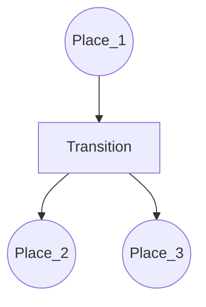
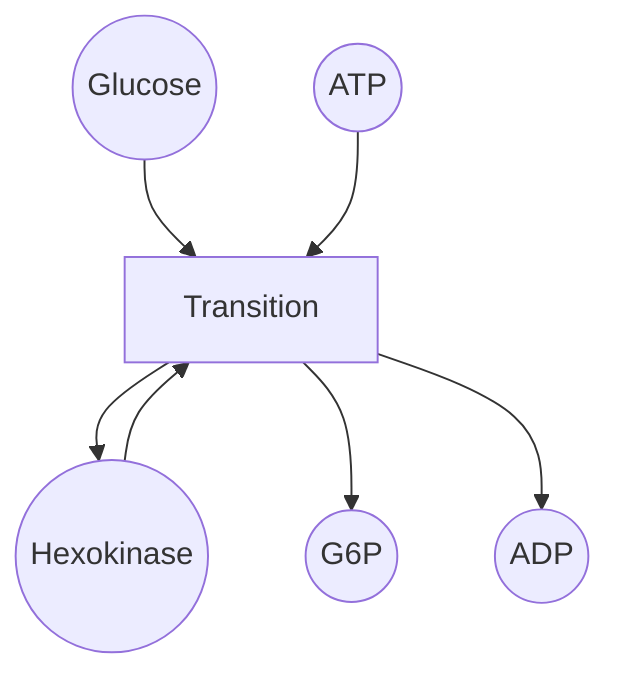
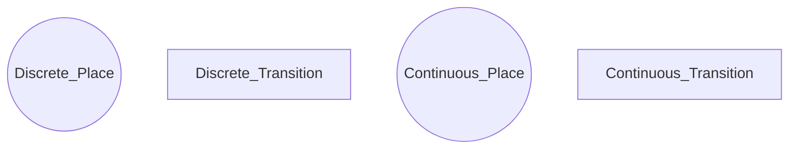
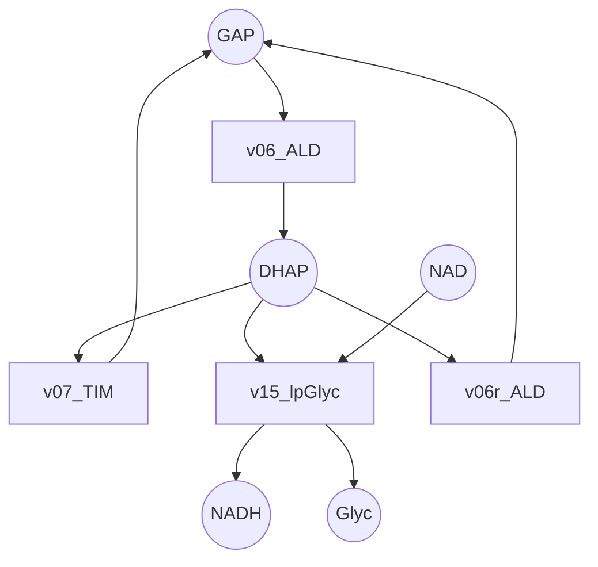

BioSystems 210 (2021) 104531

Contents lists available at ScienceDirect

BioSystems

journal homepage: www.elsevier.com/locate/biosystems

# VANESA: An open-source hybrid functional Petri net modeling and simulation environment in systems biology

Christoph Brinkrolf a,∗, Lennart Ochel b, Ralf Hofestädt a

ª *Bioinformatics Department, Faculty of Technology, Bielefeld University, 33501 Bielefeld, Germany*
ᵇ *RISE AB, 581 83 Linköping, Sweden*

ARTICLE INFO

*Keywords:*
Open-source
Petri net modeling and simulation
xHPN
Extended hybrid Petri net
OpenModelica
PNlib

ABSTRACT

Petri nets are a common method for modeling and simulation of systems biology application cases. Usually different Petri net concepts (e.g. discrete, hybrid, functional) are demanded depending on the purpose of the application cases. Modeling complex application cases requires a unification of those concepts, e.g. hybrid functional Petri nets (HFPN) and extended hybrid Petri nets (xHPN). Existing tools have certain limitations which motivated the extension of VANESA, an existing open-source editor for biological networks. The extension can be used to model, simulate, and visualize Petri nets based on the xHPN formalism. Moreover, it comprises additional functionality to support and help the user. Complex (kinetic) functions are syntactically analyzed and mathematically rendered. Based on syntax and given physical unit information, modeling errors are revealed. The numerical simulation is seamlessly integrated and executed in the background by the open-source simulation environment OpenModelica utilizing the Modelica library PNlib. Visualization of simulation results for places, transitions, and arcs are useful to investigate and understand the model and its dynamic behavior. The impact of single parameters can be revealed by comparing multiple simulation results. Simulation results, charts, and entire specification of the Petri net model as Latex file can be exported. All these features are shown in the demonstration case. The utilized Petri net formalism xHPN is fully specified and implemented in PNlib. This assures transparency, reliability, and comprehensible simulation results. Thus, the combination of VANESA and OpenModelica shape a unique open-source Petri net environment focusing on systems biology application cases. VANESA is available at: http://agbi.techfak.uni-bielefeld.de/vanesa.

## 1. Introduction

Modeling and simulation of metabolic networks is a classical topic of bioinformatics and chemical informatics. However, first publications can be found published in the field of biophysics/biomathematics more than 60 years ago. Considering the classical papers we can identify two fundamental classes of models. Discrete models like automata or formal languages and analytical models like complex differential equations. One of the first discrete models for gene regulation networks was the Kauffman network approach (Kauffman, 1969). At the end of the last century more and more discrete models were published for modeling and simulation of metabolic networks. The main reason for discrete models was (is) the gap of relevant molecular data. Based on new omics technologies this situation changed. Therefore, "Quantitative Biology" came up as a new research topic. However, molecular kinetic data is still missing in case of gene regulation or not complete in case of biochemical reactions. Therefore, flexible methods for modeling biological networks are useful. During the end of the last century the Petri net approach became popular for modeling of these processes (Reddy et al., 1993). Today we can say that the Petri net approach is the "best method" for modeling and simulation of complex biological networks (Chen and Hofestädt, 2003).

The aim of this work is to present an open-source Petri net editing and simulation environment which covers the requirements to model and simulate quantitative biological networks. Therefore, Petri nets and necessary extensions for quantitative modeling and simulation are introduced in the following section. There are only a few tools available which match these requirements (offering at least support of Petri net concepts integrated in HFPN). These tools and their limitations are discussed in the third section. In the fourth section, the open-source tool VANESA (Brinkrolf et al., 2014) and relevant changes are presented which extend the functionality of VANESA by the Petri net editing and simulation components. This allows a user-friendly access to Petri net modeling and simulation based on xHPN formalism. Simulation

∗ Corresponding author.
*E-mail address:* cbrinkro@cebitec.uni-bielefeld.de (C. Brinkrolf).
*URL:* https://www.techfak.uni-bielefeld.de/ags/bi/ (C. Brinkrolf).

https://doi.org/10.1016/j.biosystems.2021.104531
Received 31 March 2021; Received in revised form 1 August 2021; Accepted 26 August 2021
Available online 4 September 2021
0303-2647/© 2021 The Authors. Published by Elsevier B.V. This is an open access article under the CC BY-NC-ND license (http://creativecommons.org/licenses/by-nc-nd/4.0/).

Fig. 1. Structure of a Petri net based on a directed graph with two different types of nodes with initial marking $m_0(\text{Place\_1}, \text{Place\_2}, \text{Place\_3}) = (1, 1, 2)$.

itself is based on the open-source environment OpenModelica and thus, VANESA in combination with OpenModelica shape a powerful open-source modeling and simulation toolchain for extended hybrid Petri nets which is demonstrated in the fifth section.

## 2. Material and methods

C.A. Petri introduced the formalism of Petri nets in 1962 (Petri, 1962). The key idea of this formalism was to model and analyze parallel processes. Until now his concept is the most powerful formalism for this approach. Since the beginning of the 90s biology is one field of application (Reddy et al., 1993; Hofestädt, 1994).

### 2.1. Petri net

A Petri net $PN = (P, T, F, W, m_0)$ consists of a finite set of transitions ($T$) and a finite set of places ($P$), which are connected by directed arcs ($F$). $F \subseteq (P \times T) \cup (T \times P)$ is a finite set of arcs, $W$ is the weight function ($W : F \rightarrow \mathbb{N}$) of the Petri net, and the initial marking $m_0 : \mathbb{N}_0 \rightarrow P$ assigns a non-negative number of tokens to each place.

Regarding the graphical representation, places are drawn as circles, transitions are drawn as rectangles and arcs are drawn as directed arrows. Places and transitions are labeled with specific names. Places may contain tokens, which are either drawn as dots or as a number within each place as shown in Fig. 1. Tokens can be assigned to places, which is called configuration of the Petri net and $m_0$ denotes the start configuration of the Petri net. The complete definition of the ordinary Petri net is given in Reddy et al. (1993), which also presents the first paper using Petri nets for the modeling of qualitative biochemical reactions. The key message of this paper was to demonstrate that Petri nets are useful for the representation of biochemical reactions and metabolic pathways. Fig. 2 shows a model of an abstract enzyme-controlled reaction, which is the basic element of metabolic pathways.

### 2.2. Petri net concepts for biological networks

The disadvantage of this kind of application presented by Reddy et al. (1993) was that kinetic effects could not be represented. To close this gap the functional Petri net was introduced (Hofestädt and Thelen, 1998). Furthermore this paper showed that a Petri net is able to model gene-controlled metabolic networks and cell communication processes. The key idea to define the functional Petri net was to allow the quantitative modeling, which allows the realistic simulation of biological networks (Hofestädt and Thelen, 1998; Chen and Hofestädt, 2003). Finally, the usage of real numbers to simulate concentration values was one important aspect to define the Hybrid Functional Petri net (HFPN) (Matsuno et al., 2003). HFPN is an extension of the Hybrid Petri net (HPN) (Alla and David, 1998). The idea of HPN was the representation of two kinds of places and transitions that allow calculating discrete and analytical molecular values. Therefore, discrete places (discrete transitions) and continuous places (continuous transitions) were defined (Fig. 3). The idea of the continuous place is that non-negative real numbers can be used, which can be interpreted as the concentration of metabolites.

In 1998, the Hybrid dynamic net (HDN) (Drath et al., 1998), which has a similar structure as the HPN, was defined. Based on HDN and HPN formalisms, HFPN was introduced, which includes both of these features of HPN and HDN. Furthermore, HFPN has the feature of the functional Petri nets and allows assigning a function of values to any arc. Comprising these Petri net modeling concepts, HFPN is suited to model biopathways (Matsuno et al., 2003) and can be seen as a minimal set of concepts. Thus, any suitable Petri net formalism must include all concepts offered by HFPN.

Regarding the theory of Petri nets we can identify numerous further Petri net concepts representing different aspects and features. Stochastic Petri nets are useful in case of probability aspects (Marsan, 1990). Fuzzy Petri nets (Cardoso et al., 1996), colored Petri nets (Jensen, 1987) and object oriented Petri nets (Valk, 2004) are only a snapshot of this wide collection of higher Petri net definitions. For the simulation of quantitative biological networks most of these extensions are not of interest.

### 2.3. xHPN formalism

The extended hybrid Petri net formalism (xHPN) (Proß et al., 2012; Proß, 2013; Ochel, 2017) combines several Petri net concepts. By definition, xHPN is an extension of HPN which offers hybrid modeling with inhibitory and test arcs. Furthermore, xHPN supports functions for the maximal speed value in continuous transitions and functions as arc weights which includes the concepts of HDN and functional Petri nets. It defines a delay for discrete transitions as well as lower and upper capacities for places. xHPN supports stochastic transitions with a variable hazard function. All transitions have an additional enabling condition. The four different types of structural Petri net conflicts defined in David and Alla (2010) are defined in xHPN along with their autonomous resolution strategies based on probabilities and priorities. For places of the Petri net that are part of a structural conflict, such as one discrete pre-place which is connected to two discrete transitions, a conflict solving strategy can be set and corresponding values of the chosen conflict solving strategy need to be assigned to the corresponding arcs.

In summary, xHPN includes all concepts of HFPN and thus is suitable to model complex quantitative biological networks. It further comprises the concept of capacities, stochastic transitions, and conflict resolution strategies. Proß (2013) gives a comprehensive description and definition of xHPN as well as a biological application case which shows the modeling strengths of xHPN.

The formal definition of the xHPN formalism is given by the tupel $(PD, PC, TD, TS, TC, F, G, T, I, R, f, c_l, c_u, e, p, d, h, v, s, m_0)$ with:

- $PD = \{pd_1, pd_2, \dots, pd_{pd}\}$ is a finite set of discrete places,
- $PC = \{pc_1, pc_2, \dots, pc_{pc}\}$ is a finite set of continuous places,
- $TD = \{td_1, td_2, \dots, td_{td}\}$ is a finite set of discrete transitions,
- $TS = \{ts_1, ts_2, \dots, ts_{ts}\}$ is a finite set of stochastic transitions,
- $TC = \{tc_1, tc_2, \dots, tc_{tc}\}$ is a finite set of continuous transitions,
- where $PD, PC, TD, TS$, and $TC$ are pairwise disjoint,
- $F \subseteq (PD \times TD \cup PD \times TS \cup PD \times TC \cup PC \times TC \cup PC \times TD \cup PC \times TS)$ is a set of arcs from places to transitions,
- $G \subseteq (TD \times PD \cup TD \times PC \cup TS \times PD \cup TS \times PC \cup TC \times PC \cup TC \times PD)$ is a set of arcs from transitions to places,
- $N \subseteq (F \cup G)$ is a set of normal arcs,
- $T \subseteq F$ is a set of test arcs,
- $I \subseteq F$ is a set of inhibitor arcs,

Fig. 2. Petri net representation of the enzyme-catalyzed process of *Glucose* into *glucose-6-phosphate* (*G6P*) before firing (a) and after firing (b) of *Transition*.

Fig. 3. Petri net components of HPN as they are represented in VANESA.

- $N, T$, and $I$ are pairwise disjoint,
- $f : (F \cup G \cup T \cup I, m, t) \rightarrow \mathbb{N}_0 : \{p_i \in PD, \mathbb{R}_{\ge 0} : p_i \in PC\}$ is an arc weight function which assigns every arc connected to a discrete place a non-negative integer and otherwise a non-negative real-valued number depending on a subset of markings $m$ and/or time $t$,
- if $p_i \in PD$ and $t_j \in TC$ then $(p_i \rightarrow t_j) \in F$ if and only if $(t_j \rightarrow p_i) \in G$ and $f(p_i \rightarrow t_j) = f(t_j \rightarrow p_i)$,
- $c_l : \{PD \rightarrow \mathbb{N}_0, PC \rightarrow \mathbb{R}_{\ge 0}\}$ assigns each place a minimum capacity,
- $c_u : \{PD \rightarrow \mathbb{N}_0, PC \rightarrow \mathbb{R}_{\ge 0}\}$ assigns each place a maximum capacity, with $c_l(p_i) < c_u(p_i) \ \forall \ p_i \in (PD \cup PC)$,
- $e : (PD \cup PC) \rightarrow \{prio, prob\}$ is an enabling function which assigns every arc connected to a discrete transition either a priority or a probability according to the resolution type,
- if $e(p_i) = prio$ then $\mathrm{p}(p_i \rightarrow t_k) \ne \mathrm{p}(p_i \rightarrow t_l) \ \forall \ t_k, t_l \in TD_{out}(p_i)$ and $\mathrm{p}(t_k \rightarrow p_i) \ne \mathrm{p}(t_l \rightarrow p_i) \ \forall \ t_k, t_l \in TD_{in}(p_i)$,
- if $e(p_i) = prob$ then $\sum_{t_k \in TD_{out}(p_i)} \mathrm{p}(p_i \rightarrow t_k) = 1$ and $\sum_{t_k \in TD_{in}(p_i)} \mathrm{p}(p_k \rightarrow t_i) = 1$,
- $d : TD \rightarrow \mathbb{R}_{\ge 0}$ is a delay function which assigns every discrete transition a non-negative real-valued delay,
- $h : (TS, m) \rightarrow \mathbb{R}_{\ge 0}$ is a hazard function which assigns every stochastic transition a non-negative, real valued random delay depending on a concrete marking $m$,
- $v : (TC, m, t) \rightarrow \mathbb{R}_{\ge 0}$ is a maximal speed function which assigns every continuous transition a non-negative, real-valued maximal speed which depends on a subset of concrete markings $m$ and/or time $t$,
- $s : (TD \cup TS \cup TC, \epsilon) \rightarrow \{\text{true}, \text{false}\}$ is a condition function which assigns every transition a condition depending on several environmental factors $\epsilon$ e.g. time, and
- $m_0 : \{PD \rightarrow \mathbb{N}_0, PC \rightarrow \mathbb{R}_{\ge 0}\}$ is the initial marking which must satisfy the condition $c_l(p_i) \le m_0(p_i) \le c_u(p_i) \ \forall \ p_i \in (PD \cup PC)$.

### 2.4. PNlib: Implementation of the xHPN formalism

The xHPN formalism is implemented in the modeling language Modelica. Modelica (Modelica Association, 0000b) is a free equation-based language for modeling cyber–physical systems. The choice of implementing the Petri net formalism in Modelica, rather than directly implementing it in a traditional programming language, allows abstraction and reduction of implementation errors. The availability of several commercial compilers (Modelica Association, 0000a) as well as the open-source implementation OpenModelica Compiler (OMC) (Fritzson et al., 2005) makes the Petri net simulations independent of one specific implementation. The OpenModelica Compiler (OMC) is part of the OpenModelica project. Development of OpenModelica started more than 20 years ago and is actively and financially supported by the Open Source Modelica Consortium (OSMC). Its aim is to be a free implementation for academic and industrial usage.

The PNlib (Proß and Bachmann, 2012; Ochel, 2017) is a complete and open-source implementation of the xHPN formalism . It is implemented as a stand-alone Modelica library and available on GitHub (Ochel et al., 0000). Therewith, its entire behavior is formally defined by the Modelica modeling language specification and independent from a specific tool implementation. It is text-based and equation-based and thus transparent in its description of the Petri net formalism.

## 3. Related works

Over the course of years, many different Petri net editors and simulation tools have been developed and implemented. Most of these implementations are either editors without simulation functionality or focus on one specific Petri net concept, such as discrete, hybrid, stochastic, or others. Only a few tools allow modeling and simulation using hybrid functional Petri nets and thus match the requirements for

quantitative modeling and simulation for systems biology application cases. Besides VANESA in combination with OpenModelica presented in this paper, there are only two other tools available: the commercial software Cell Illustrator (Nagasaki et al., 2010) and the free software Snoopy (Heiner et al., 2012). Cell Illustrator with its graphical user interface is tailored to use cases from molecular and systems biology since its representation of Petri net elements is strongly connected to biological entities and relations. The main disadvantage of Cell Illustrator is the lacking documentation of simulation since it is implemented as a black-box. Snoopy with its graphical user interface is a general purpose tool supporting modeling and simulation of many Petri net classes, such as: discrete, continuous, hybrid, fuzzy Petri nets. For some simulation settings non-negative markings are not assured which would violate the Petri net formalism. A more detailed comparison of Snoopy, Cell Illustrator and VANESA is given in Brinkrolf et al. (2018).

## 4. Implementation

The previous section pointed up the lack of a fully transparent modeling and simulation environment which supports at least the concepts of HFPN and strictly implements them. Thus, an existing graphical editor for biological networks is extended by Petri net components. The editor itself as well as the major implementations are described in the following subsections.

### 4.1. VANESA

VANESA (Brinkrolf et al., 2014) is an open-source tool assisting scientists during the processes in systems biology workflow. It offers a graphical user interface and biological networks as a graph-based modeling approach. In a biological network, nodes represent biological entities (such as enzymes, metabolites, DNA) and edges connecting nodes represent relations between these biological entities (such as reactions, inhibitions, activations). A biological network can either be created from scratch based on literature data and findings from wet-lab experiments or the data warehouse DAWIS-M.D. (Hippe et al., 2010) can be consulted. DAWIS-M.D. consists of several molecular databases such as KEGG (Kanehisa et al., 2012), Brenda (Scheer et al., 2011), IntAct (Kerrien et al., 2012), and pathways or depth search results requested via web service can be used as a base model. Such a retrieved biological network can be improved by further adjustment and extension. The representation (shape and color) of each biological entity can be defined by the user.

Different graph layout algorithms try to layout the graph in a nice way to keep the overview if models get larger. Another implemented concept to assist dealing with larger models are nested hierarchies as shown in Fehling (1993). It allows the user to focus only on parts of interest on the model while collapsing the rest. There is no limit in the level of hierarchies.

Properties of each node, such as name, label, color, minimal/maximal and start concentration, can be edited as easy as adjusting properties of edges, such as name, label, color, and if the edge is directed. Some basic graph analysis algorithms, such as shortest path, are implemented as well as comparing, intersecting, and merging of graphs, based on node names. Highlighting the shortest path of two metabolites in a pathway can be useful to visualize the enzyme cascade from a global substrate (such as Glcx in Fig. 7) to a global product (such as Glyc or EtOH in Fig. 7). Merging pathways allows the integration of pathways from multiple data sources into one single enriched pathway while the intersection of two pathways reduces the complexity to the common (and hypothetically most relevant) subgraph. These techniques were already applied successfully in Hamzeiy et al. (2018).

Several export file formats are supported. Each model is saved as a SBML Level 3 Version 1 (Chaouiya et al., 2015) file which is extended by VANESA-specific attributes using SBML annotations. Image exports of the graph as SVG and PNG file allows further use, such as in publications.

An overview of the GUI of VANESA with a retrieved KEGG pathway from the data warehouse is shown in Fig. 4.

Beside modeling biological networks, VANESA also offers Petri net modeling, simulation, and visualization of simulation results. Some of the limitations of VANESA were mentioned in Brinkrolf et al. (2014). Regarding modeling, parts of the xHPN formalism were missing in the GUI of VANESA (such as setting conflict resolution strategy), discrete elements and test arcs could not be simulated, and only one single simulation result could be handled and visualized after the simulation process finished its computation. Beside, only the change of tokens for places could be visualized. To address these limitations and further improve the workflow and usability of modeling and simulation of Petri nets, as well as visualizing the simulation result, major improvements and extensions were added.

In the following subsections the major changes and improvements of VANESA regarding Petri nets are presented.

### 4.2. Modeling

For places, the ability to edit the conflict resolution strategy (none, priority, probability) was added to cover the entire xHPN formalism. This option is only visible if the particular place or arc is part of a structural conflict. If either priority or probability is selected, the corresponding values on the arcs can be checked and solved. In case of priority, the priorities of the corresponding arcs must be unique and in case of probability, the sum of the probabilities of the corresponding arcs must be 1.

If the dynamic behavior of a certain place is not of interest, the token value of this place can be set to constant. During simulation, the number of tokens in that place will not change. Logical places are implemented to help avoiding arcs crossing large parts of the Petri net. Adding a place with a name which already exists in the Petri net will result in the creation of a logical place. The origin of a logical place can be highlighted in the Petri net as well as all logical places of a specific place (e.g. ATP and all of its logical copies).

For transitions, the firing condition is added to cover the entire xHPN formalism. The firing condition has to evaluate to true to enable this particular transition. Analogous to constant places, transitions can be disabled by checking knock-out. This results in a maximal firing speed of 0 during simulation without the need to edit or delete the actual kinetic function. While editing a kinetic function, it gets rendered nicely in Latex and if syntax errors occur, the position of the first syntax error is highlighted. Additionally, the Latex pretty print helps to avoid structural errors which easily could happen typing plain mathematical terms of complex kinetic functions. Extraction of constants (such as $v_m$ and $k_m$ values) to individual parameters improves the usability of complex functions. If the value of a constant needs to be edited, it is not necessary to edit all occurrences of this constant in the function. Instead, the value of the corresponding parameter can be changed without the need to touch the equation itself. In addition, unit specific modeling is supported by assigning a physical unit to each parameter. The evaluation of physical units might reveal structural errors of a function. If there are parameters $a, b, c$ with the same physical unit, and the correct term $\frac{(a-b)}{c}$ was accidentally changed to $a - \frac{(b)}{c}$ by the shift of one bracket, this mistake can be revealed since there is a mismatch of units in the subtraction. An overview of the graphical user interface for Petri net modeling in the context of a selected transition is shown in Fig. 5.

For all arcs, functions are added to cover the entire xHPN formalism. A function on a regular arc defines its arc weight while functions on inhibitory and test arcs act as thresholds.

> ⚠️ [fallback] diagrama não convertido; abaixo, imagem original e descrição.

A interface do software científico VANESA 2.0 apresenta um diagrama de rede biológica modelando a via de glicólise e gliconeogênese humana, composta por 92 nós e 128 arestas interligando círculos amarelos e triângulos verdes com rótulos moleculares. Ao lado esquerdo, painéis de controle exibem campos de busca em bancos de dados biológicos como KEGG e configurações detalhadas de propriedades de elementos químicos. Uma barra de ferramentas vertical à direita reúne ícones para manipulação visual, edição de grafos e navegação no espaço de trabalho.

Fig. 4. Graphical user interface of VANESA with glycolysis pathway retrieved from KEGG. Enzymes are shown as green triangles while metabolites are yellow circles. The metabolites on the very right from top to bottom are Glucose, Glycerone phosphate (Glyc), and Ethanol.

### 4.3. Simulation

For the process of simulation, the Petri net gets exported as a Modelica model and then compiled using PNlib and OpenModelica compiler to create the simulation executable. The communication between VANESA and simulation executable is based on TCP/IP server–client model.

During the process of compilation, the physical units of each equation are checked and feedback on mismatches are given to the user. Once the model is compiled, the simulation executable (client) connects to VANESA (server) and its execution is started which will then compute the actual numerical simulation results. During the process of computation, already computed simulation results are made available in VANESA even before the entire simulation is finished. It is not necessary anymore to wait until the result file is generated which then was mapped on the Petri net. Since both processes, compilation and simulation execution, are threaded, the user can cancel both processes anytime.

In the simulation menu, the stop time, number of returned evaluated time steps, and the integrator can be defined, as well as if the executable should be forced to get (re-)compile. If only certain parameters of the model changed, it is not necessary to recompile the model but to run the executable with adjusted parameters. An overview of the simulation menu is shown in Fig. 6. VANESA can handle multiple simulation results for each Petri net. The list of available simulation results, which are either imported from file or obtained by a simulation run, is shown in the simulation menu as well. Each simulation result can be (de)activated, named, deleted, and its simulation log can be shown. For visualization of simulation results, only active simulation results are taken into account.

### 4.4. Visualization of simulation results

In general, for places the number of tokens over time is shown, for transitions the actual firing speed over time is shown, and for arcs the token flow at each time step (for arcs connecting discrete or continuous transition, but stochastic transition) as well as the sum of tokens are shown. Especially for continuous parts of a Petri net the visualization of token flow is very helpful. Even if the number of tokens over time for one particular place does not change, it does not mean that there is no token flow. It only tells that the flow of token into this place equals the flow of token out of this place for each time step.

As mentioned in the previous subsection, multiple active simulation results are supported and simulation results for evaluated time steps are visualized even if the simulation did not finish, yet. If one Petri net is simulated multiple times but each time the value of one particular parameter (e.g. $k_m$ or $v_m$) is slightly changed, the support of multiple simulation results can be very useful to compare and analyze the simulation results easily. Selecting one single item (e.g. one place or transition or arc) will show all simulation results of that specific item. This allows the investigation of the influence of the changed parameter on the simulation results of the selected item. Such an analysis might tell if that particular parameter is rather robust or sensitive to the Petri net and could help to get a better understanding of the model. It can be also used to monitor tuning of parameters.

If more than one element of the same type is selected (e.g. two places), the most recent active simulation result of these elements are shown. This allows the direct comparison of elements for one single simulation result.

The plot of the simulation results can be zoomed and opened as a large single window. Additionally, an overview of the most recent active simulation results for all places as individual charts is provided either with global or local scaling.

Fig. 5. Graphical user interface of VANESA for Petri net modeling. Transition *v07_TIM* of glycolysis Petri net is picked. The entire Petri net is shown in Fig. 7. On the left, simulation results and properties of the selected transition are shown. In the center there is the parameter window of the maximal speed function. Structural error is highlighted (additional closing bracket), function is rendered in Latex, and the list of parameters is given.

Uma janela de software intitulada "VANESA - simulation setup" apresenta controles de configuração de simulação na parte superior, incluindo campos para tempo de início, término, intervalos e seleção de integrador. À esquerda, há uma lista com três simulações ativas nomeadas e botões de ação associados, como "log", "detailed", "export" e "del". O lado direito exibe um painel de texto com o registro de execução do processo, detalhando mensagens de sucesso, propriedades da simulação e estatísticas de tempo de cada etapa.

Fig. 6. Simulation menu with simulation properties on the top. On the left there is a list of available simulation results and the text field on the right shows the selected simulation log.

### 4.5. Exports

Transparency of the model is very important for collaborations. Thus, a Latex documentation can be generated which contains an overview of the Petri net, all (biochemical) equations including stoichiometries, all equations including their parameters and physical unit information, and further parameters which are necessary to reproduce the simulation. For further processing, simulation results can be exported as CSV file and each chart of simulation result can be exported as PNG, SVG, and PDF file.

## 5. Demonstration case

As a demonstration case, we decided to model the glycolysis pathway shown in Fig. 4 because it is an essential pathway occurring in almost every organism. Hynne et al. (2001) published a full-scale model of the biochemical pathway of glycolysis and glycolytic oscillations in intact yeast cells. It was built to fit experimental substrate concentrations and dynamical properties measured at stationary state while rate constants and maximum velocities have been calculated using experimental data. All biochemical equations as well as their corresponding kinetic speed functions, parameters with units, and initial concentrations are given.

Based on this data published in Hynne et al. (2001), the Petri net was modeled. Each metabolite and its concentration is represented as a continuous place with tokens equal to the concentration value. Enzymes are modeled as continuous functional transitions. The velocity of each enzyme corresponds to the maximal speed function of the transition. Parameters occurring in speed functions were extracted and modeled individually while also taking their physical units into account.

The topology of the Petri net is given by the list of reactions. Stoichiometry of reactions is represented as arc weights. The resulting Petri net is shown in Fig. 7. Elements with a dashed border are logical places.

After modeling, the Petri net was simulated and simulation results for the places Pyr, ATP, EtOH, Glcx, and Glc are shown in Fig. 8. Overall it shows that EtOH (green) is produced, the concentration of ATP (yellow) reaches steady state, and all other metabolites are consumed such that their concentrations decrease to (almost) 0 tokens over time. The production rate of EtOH depends on the firing speed of transition v12_ADH which is connected to an arc to EtOH. The corresponding simulation results are shown in Fig. 9.

For further investigation and understanding of the model, two additional simulation runs were performed. The aim was to understand the impact of a particular parameter: $v_m$ of transition *v07_TIM*. The original value of $v_m = 116.365\text{ mmol/min}$ was set to $220\text{ mmol/min}$ in the second run and to $440\text{ mmol/min}$ in the third run. The overview of the simulation menu including the list of simulation results is shown in Fig. 6. The variation of this particular parameter does not show an effect on the simulation results of Glc and Glcx, but an increase of $v_m$ decreases concentration of Glyc and increases concentration of EtOH over time as shown in Fig. 10. The model contains some reversed reactions which allows circulation of tokens. One example is the pair of transitions *v09_lp_PEP* and *v09r_lp_PEP* which produce and consume tokens from BPG and PEP. Fig. 11 shows the accumulation of BPG and PEP. Their concentrations increase significantly while their absolute values are rather small, less than 0.12. This might be surprising since the absolute values of firing speed of *v09_lp_PEP* and passing tokens of arc connecting PEP to transition *v09r_lp_PEP* are much greater (several hundred), as shown in Fig. 12. Circulation of tokens can only be observed if simulation results of firing speed of transitions or token flow of arcs are visualized. In this example, the token flow over arcs is equal to the firing speed of the corresponding transition because the arc weight is 1. If the arc weight is a more complex function (e.g. depending on number of tokens in places), for a proper investigation of simulation results firing speed and passing tokens on arcs need to be visualized.

All raw data of this demonstration case, such as the Petri net, simulation results, and generated documentation of the model are available as supplement.

## 6. Conclusions

Petri nets are a suitable method to model quantitative systems biology application cases if the formalism of choice comprises at least the concepts of discrete, continuous, hybrid, and functional Petri nets, such as HFPN or xHPN. Starting with a basic discrete model based on rudimentary molecular knowledge, it can be extended by quantitative aspects. There are only a few tools available which offer modeling and simulation of HFPN. Since these tools have their strengths but also limitations, we decided to develop an open-source alternative. Thus, VANESA, which is a graphical editor for biological networks and so far had only a very basic Petri net support, was extended to a fully functional Petri net modeling and simulation environment. The main features are Petri net modeling, editing, simulation, and the visualization of simulation results. In the background, OpenModelica Compiler and PNlib, both are open-source as well, are utilized to perform the actual numerical simulation.

The demonstration case shows some key features of the Petri net component. During modeling, it supports the user dealing with (complex) kinetic functions. Syntax and unit checking might avoid or even reveal errors. Logical places keep the visualization of the Petri net clean, once it gets bigger. Simulation is performed depending on given simulation properties and VANESA can handle multiple simulation results which are visualized if activated. Visualization of simulation results helps the user to investigate the dynamic behavior of the Petri net. For a single simulation result, the token over time for one or multiple places can be compared as well as the firing speed of transitions and passing tokens over arcs. Especially for continuous parts of a Petri net, visualization of firing speed and/or passing tokens over arcs are essential and helpful to reveal circulating tokens and thus gaining a better understanding of the model. Visualization of multiple simulation results for a single item (one place, or transition, or arc) is useful to show the effect of changed parameters during the multiple simulation runs on that particular single item. It might be useful to distinguish if a parameter is rather sensitive of robust or to ask questions and generate hypothesis on the model: what might happen if start concentrations differ, concentrations are constant, transitions are knocked out, kinetic functions vary, arc weights differ, or any other property of the Petri net changed. Sharing and discussing the model and its simulation results is supported by various export functions: automatically generated Latex export of the entire Petri net model with all its functions and parameters, picture export of all charts and the Petri net graph itself in several file formats, and import and export of raw simulation results as CSV file.

We will further improve the Petri net component of VANESA in the future. A parameterized simulation is in development which allows to alter a single parameter for multiple simulation runs. In addition, further simulation properties to adjust the simulation for special use cases and expert users will be added, since OpenModelica allows various properties to be set. The next big step will be closing the gap between a biological network and a Petri net which is needed for simulation. We are working on the adjustable automatic transformation of a quantitative biological network into a Petri net, such that the biological network can then be simulated based on the underlying Petri net. Depending on the user, the Petri net is either hidden or can be investigated/edited as well.

In summary, VANESA is an editor for biological networks as well as a fully functional Petri net editing and simulation environment focusing on systems biology application cases. VANESA, as well as OpenModelica and PNlib, are open-source and the implemented xHPN formalism is entirely specified. This allows a transparent, reliable, and comprehensible simulation which makes this environment useful and unique. VANESA is available at: http://agbi.techfak.uni-bielefeld.de/vanesa.

> ⚠️ [fallback] diagrama não convertido; abaixo, imagem original e descrição.

Trata-se de um diagrama em preto e branco que representa uma rede de Petri da via metabólica da glicólise e fermentação alcoólica. A estrutura é composta por nós circulares com valores numéricos para metabólitos e cofatores como ATP, ADP, NADH e glicose, conectados por setas direcionais a nós retangulares que simbolizam as reações enzimáticas. No canto superior direito, há circuitos isolados que ilustram reações paralelas de consumo de energia e interconversão de nucleotídeos de adenina.

Fig. 7. Glycolysis pathway (Hynne et al., 2001) modeled as Petri net.

Um gráfico de linhas com fundo cinza apresenta a variação da quantidade de "Tokens" no eixo vertical (de 0 a 28) em função do "Time" no eixo horizontal (de 0,00 a 0,50) para cinco substâncias: Glc, Pyr, ATP, Glcx e EtOH. A curva verde (EtOH) sobe de forma contínua de cerca de 19 até quase 28 tokens, enquanto as curvas azul-clara (Glc) e azul-escura (Glcx) caem para zero logo no início, por volta do tempo 0,05. A linha amarela (ATP) sobe de 2 para cerca de 4 tokens próximo ao tempo 0,10 e estabiliza-se, ao passo que a linha rosa (Pyr) permanece em torno de 9 até 0,10, decrescendo depois continuamente até zerar perto de 0,33.

Fig. 8. Selected simulation results of Petri net shown in Fig. 7 after simulating for 0.5 time units.

Dois gráficos lado a lado sobre fundo cinza ilustram o comportamento de tokens ao longo de um período de 0 a 0,50 unidades de tempo. O gráfico à esquerda exibe uma curva roxa que se mantém próxima de 48 até cerca de 0,10, ponto em que sofre uma queda brusca para cerca de 13 e continua decrescendo lentamente até perto de 6. O gráfico à direita combina uma linha vermelha tracejada que reproduz esse mesmo padrão de queda acentuada no fluxo de tokens com uma linha vermelha contínua que representa a soma acumulada, a qual sobe rapidamente até 0,10 e depois mantém uma inclinação ascendente constante.

Fig. 9. (a) Visualization of firing speed of transition *v12_ADH* and (b) token flow of the arc from transition *v12_ADH* to place *EtOH*.

Dois gráficos de linhas dispostos lado a lado comparam resultados de simulações com o tempo no eixo horizontal e a quantidade de tokens no eixo vertical, variando três valores para o parâmetro "v07_TIM_v_m" representados pelas cores vermelha, verde e azul. O gráfico da esquerda, rotulado como "(a) Simulation results of Glyc.", apresenta curvas que sobem rapidamente de 4,2 até cerca de 4,5–4,6 antes de se estabilizarem em uma inclinação suave até o tempo 0,50, com a curva vermelha no nível mais alto. O gráfico da direita, identificado como "(b) Simulation results of EtOH, zoomed in.", foca em valores entre 26,0 e 28,0 a partir do tempo 0,20, exibindo um crescimento linear ascendente no qual a curva azul atinge a posição mais elevada, seguida pela verde e pela vermelha.

Fig. 10. Comparison of simulation results over time for places *Glyc* and *EtOH*.

Dois gráficos de linhas dispostos lado a lado comparam os resultados de simulação de BPG e PEP em função do tempo, que varia de 0,00 a 0,50 no eixo horizontal, com a quantidade de *tokens* no eixo vertical. Cada painel apresenta três curvas contínuas correspondentes a diferentes valores do parâmetro `v07_TIM_v_m`: vermelho para 116,365, verde para 220,0 e azul para 440,0. Em ambos os casos, observa-se uma elevação mais acentuada nas trajetórias logo após o tempo 0,10, com níveis finais mais altos associados ao maior valor do parâmetro testado.

Fig. 11. Comparison of simulation results over time for places *BPG* and *PEP*.

Dois gráficos de linha lado a lado apresentam resultados de simulação ao longo do tempo (de 0,0 a 0,5) para três valores do parâmetro "v07_TIM_v_m": 116.365 (vermelho), 220.0 (verde) e 440.0 (azul). O gráfico à esquerda, rotulado como (a), exibe a velocidade de disparo da transição v09_lp_PEP, cujas curvas sofrem uma rápida elevação a partir de 0,10 unidades de tempo antes de estabilizarem em patamares entre aproximadamente 380 e 570 tokens. O gráfico à direita, rotulado como (b), relaciona o fluxo (linhas tracejadas no eixo direito) e a soma cumulativa de tokens (linhas contínuas no eixo esquerdo) de um arco associado ao local PEP, mostrando valores crescentes proporcionais ao parâmetro avaliado.

Fig. 12. Comparison of simulation results over time for transition *v09_lp_PEP* and the arc from place *PEP* to transition *v09r_lp_PEP*.

## Declaration of competing interest

The authors declare that they have no known competing financial interests or personal relationships that could have appeared to influence the work reported in this paper.

## Appendix A. Supplementary data of the demonstration case

Supplementary material related to this article can be found online at https://doi.org/10.1016/j.biosystems.2021.104531.

## References

Alla, H., David, R., 1998. Continuous and hybrid Petri nets. J. Circuits Syst. Comput. 08 (01), 159–188. http://dx.doi.org/10.1142/S0218126698000079, URL: arXiv:https://doi.org/10.1142/S0218126698000079.

Brinkrolf, C., Henke, N.A., Ochel, L., Pucker, B., Kruse, O., Lutter, P., 2018. Modeling and simulating the aerobic carbon metabolism of a green microalga using petri nets and new concepts of vanesa. J. Integr. Bioinform. 15 (3), http://dx.doi.org/10.1515/jib-2018-0018.

Brinkrolf, C., Janowski, S.J., Kormeier, B., Lewinski, M., Hippe, K., Borck, D., Hofestädt, R., 2014. VANESA - A software application for the visualization and analysis of networks in system biology applications. J. Integr. Bioinform. 11 (2), 239. http://dx.doi.org/10.2390/biecoll-jib-2014-239.

Cardoso, J., Valette, R., Dubois, D., 1996. Fuzzy Petri nets: An overview. IFAC Proc. Vol. 29 (1), 4866–4871. http://dx.doi.org/10.1016/S1474-6670(17)58451-7, URL: https://www.sciencedirect.com/science/article/pii/S1474667017584517, 13th World Congress of IFAC, 1996, San Francisco USA, 30 June - 5 July.

Chaouiya, C., Keating, S., Berenguier, D., Naldi, A., Thieffry, D., van Iersel, M., Le Novere, N., Helikar, T., 2015. The systems biology markup language (SBML) level 3 package: Qualitative models, version 1, release 1. J. Integr. Bioinform. 12 (2), 270.

Chen, M., Hofestädt, R., 2003. Quantitative petri net model of gene regulated metabolic networks in the cell. Stud. Health Technol. Inform. 162, 38–55.

David, R., Alla, H., 2010. Discrete, Continuous, and Hybrid Petri Nets, second ed. Springer-Verlag Berlin Heidelberg, Berlin, Heidelberg.

Drath, R., Engmann, U., Schwuchow, S., 1998. Hybrid aspects of modelling manufacturing systems using modified Petri nets. IFAC Proc. Vol. 31 (31), 145–151. http://dx.doi.org/10.1016/S1474-6670(17)41019-6, URL: https://www.sciencedirect.com/science/article/pii/S1474667017410196, 5th IFAC Workshop on Intelligent Manufacturing Systems 1998 (IMS’98), Gramado, Brazil, 9-11 November.

Fehling, R., 1993. A concept of hierarchical Petri nets with building blocks. In: Rozenberg, G. (Ed.), Advances in Petri Nets 1993. Springer Berlin Heidelberg, Berlin, Heidelberg, pp. 148–168.

Fritzson, P., Aronsson, P., Lundvall, H., Nyström, K., Pop, A., Saldamli, L., Broman, D., 2005. The OpenModelica modeling, simulation, and software development environment. Simul. News Eur. 15 (44/45), 8–16.

Hamzeiy, H., Suluyayla, R., Brinkrolf, C., Janowski, S., Hofestädt, R., Allmer, J., 2018. Visualization and analysis of mirnas implicated in amyotrophic lateral sclerosis within gene regulatory pathways. Stud. Health Technol. Inform. 253, 183–187.

Heiner, M., Herajy, M., Liu, F., Rohr, C., Schwarick, M., 2012. Snoopy – a unifying Petri net tool. In: Haddad, S., Pomello, L. (Eds.), Application and Theory of Petri Nets. Springer Berlin Heidelberg, Berlin, Heidelberg, pp. 398–407.

Hippe, K., Kormeier, B., Töpel, T., Janowski, S., Hofestädt, R., 2010. DAWIS-M.D. - A data warehouse system for metabolic data. In: Fähnrich, K.-P., Franczyk, B. (Eds.), Informatik 2010: Service Science - Neue Perspektiven FÜR Die Informatik, Beiträge Der 40. Jahrestagung Der Gesellschaft FÜR Informatik E.V. (GI), Band 2, 27.09. - 1.10.2010, Leipzig, Deutschland. In: LNI, vol. 175, GI, pp. 720–725.

Hofestädt, R., 1994. A petri net application to model metabolic processes. Syst. Anal. Model. Simul. 16, 113–122.

Hofestädt, R., Thelen, S., 1998. Quantitative modeling of biochemical networks. Silico Biol. 1, 39–53.

Hynne, F., Danø, S., Sørensen, P., 2001. Full-scale model of glycolysis in saccharomyces cerevisiae. Biophys. Chem. 94 (1), 121–163. http://dx.doi.org/10.1016/S0301-4622(01)00229-0.

Jensen, K., 1987. Coloured Petri nets. In: Brauer, W., Reisig, W., Rozenberg, G. (Eds.), Petri Nets: Central Models and their Properties. Springer Berlin Heidelberg, Berlin, Heidelberg, pp. 248–299.

Kanehisa, M., Goto, S., Sato, Y., Furumichi, M., Tanabe, M., 2012. KEGG For integration and interpretation of large-scale molecular data sets. Nucleic Acids Res. 40 (Database Issue), 109–114.

Kauffman, S., 1969. Metabolic stability and epigenesis in randomly constructed genetic nets. J. Theoret. Biol. 22 (3), 437–467. http://dx.doi.org/10.1016/0022-5193(69)90015-0, URL: https://www.sciencedirect.com/science/article/pii/0022519369900150.

Kerrien, S., Aranda, B., Breuza, L., Bridge, A., Broackes-Carter, F., Chen, C., Duesbury, M., Dumousseau, M., Feuermann, M., Hinz, U., Jandrasits, C., Jimenez, R., Khadake, J., Mahadevan, U., Masson, P., Pedruzzi, I., Pfeiffenberger, E., Porras, P., Raghunath, A., Roechert, B., Orchard, S., Hermjakob, H., 2012. The IntAct molecular interaction database in 2012. Nucleic Acids Res. 40 (Database Issue), 841–846.

Marsan, M.A., 1990. Stochastic Petri nets: An elementary introduction. In: Rozenberg, G. (Ed.), Advances in Petri Nets 1989. Springer Berlin Heidelberg, Berlin, Heidelberg, pp. 1–29.

Matsuno, H., Tanaka, Y., Aoshima, H., Doi, A., Matsui, M., Miyano, S., 2003. Biopathways representation and simulation on hybrid functional Petri net. Silico Biol. 3 (3), 389–404.

Modelica Association, 0000a. Modelica Tools webpage, URL: https://www.modelica.org/tools/.

Modelica Association, 0000b. Modelica webpage, URL: https://www.modelica.org/.

Nagasaki, M., Saito, A., Jeong, E., Li, C., Kojima, K., Ikeda, E., Miyano, S., 2010. Cell Illustrator 4.0: a computational platform for systems biology. Silico Biol. 10 (1), 5–26.

Ochel, L., 2017. Petri-Netz-basierte Simulation biologischer Prozesse mit OpenModelica (Ph.D. thesis). Bielefeld University, Bielefeld.

Ochel, L., Brinkrolf, C., Lask, T., Proß, S., Bachmann, B., 0000. PNlib webpage, URL: https://github.com/AMIT-FHBielefeld/PNlib.

Petri, C.A., 1962. Kommunikation mit Automaten (Ph.D. thesis). Universität Hamburg.

Proß, S., 2013. Hybrid Modeling and Optimization of Biological Processes (Ph.D. thesis). Bielefeld University, Bielefeld, p. 293.

Proß, S., Bachmann, B., 2012. Pnlib - an advanced Petri net library for hybrid process modeling. In: Otter, M., Zimmer, D. (Eds.), Proceedings of the 9th International Modelica Conference. Linköping University Electronic Press, pp. 47–56. http://dx.doi.org/10.3384/ecp1207647.

Proß, S., Janowski, S., Bachmann, B., Kaltschmidt, C., Kaltschmidt, B., 2012. PNlib - A modelica library for simulation of biological systems based on extended hybrid petri nets. In: Heiner, M., Hofestädt, R. (Eds.), Proceedings of the 3rd International Workshop on Biological Processes & Petri Nets (BioPPN 2012), Satellite Event of Petri Nets 2012, Hamburg, Germany, June 25, 2012. In: CEUR Workshop Proceedings, vol. 852, CEUR-WS.org, pp. 47–61, URL: http://CEUR-WS.org/Vol-852/.

Reddy, V., Mavrovouniotis, M., Liebman, M., 1993. Petri Net representations in metabolic pathways. Proc. Int. Conf. Intell. Syst. Mol. Biol. 1, 328–336.

Scheer, M., Grote, A., Chang, A., Schomburg, I., Munaretto, C., Rother, M., Söhngen, C., Stelzer, M., Thiele, J., Schomburg, D., 2011. BRENDA, the enzyme information system in 2011. Nucleic Acids Res. 39 (Database Issue), 670–676.

Valk, R., 2004. Object Petri nets. In: Desel, J., Reisig, W., Rozenberg, G. (Eds.), Lectures on Concurrency and Petri Nets: Advances in Petri Nets. Springer Berlin Heidelberg, Berlin, Heidelberg, pp. 819–848. http://dx.doi.org/10.1007/978-3-540-27755-2_23.
